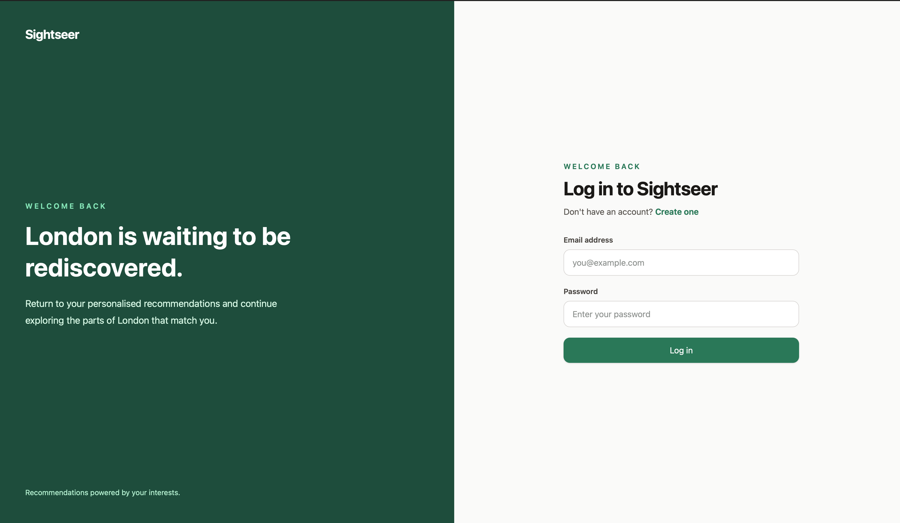
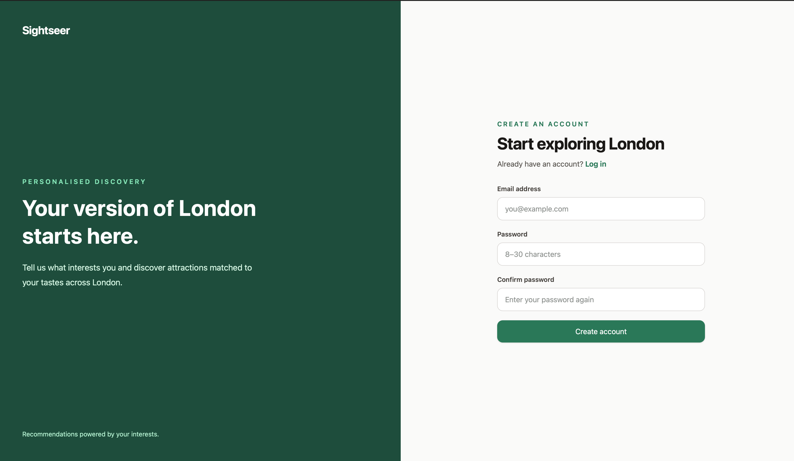
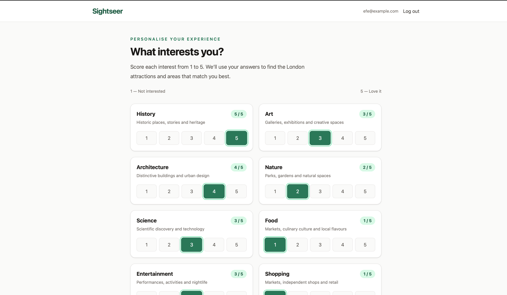
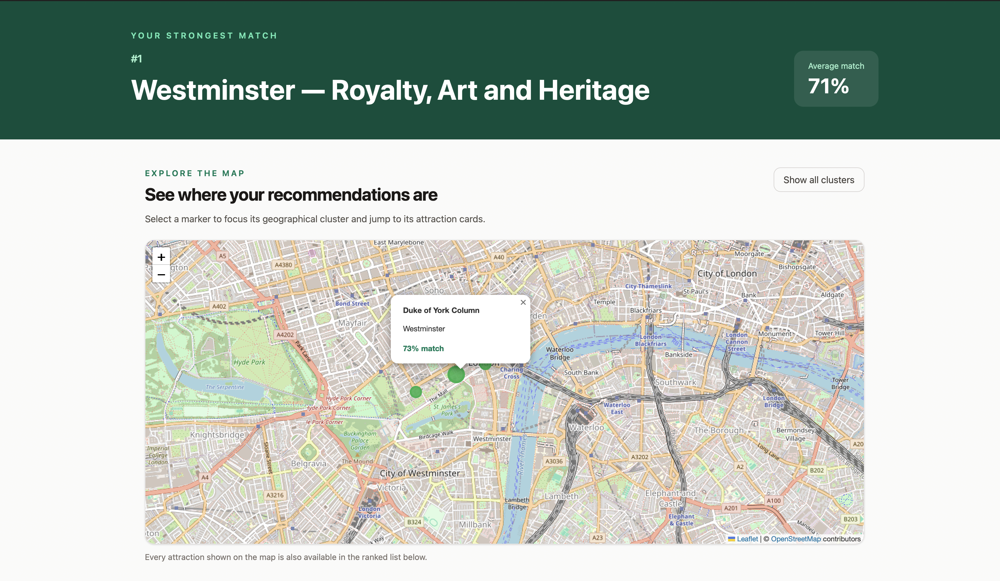
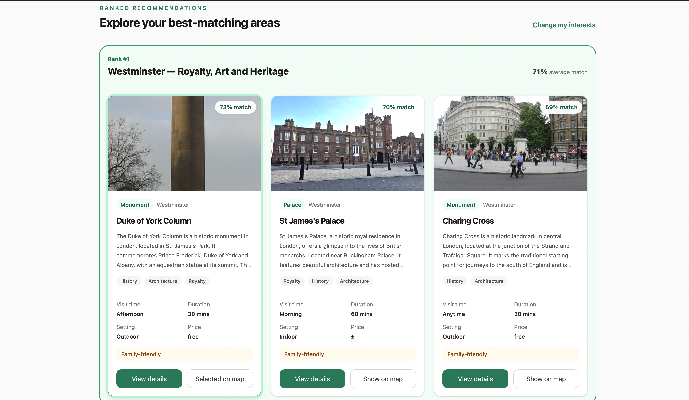
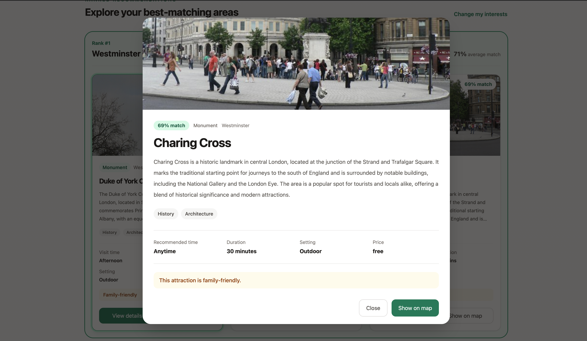
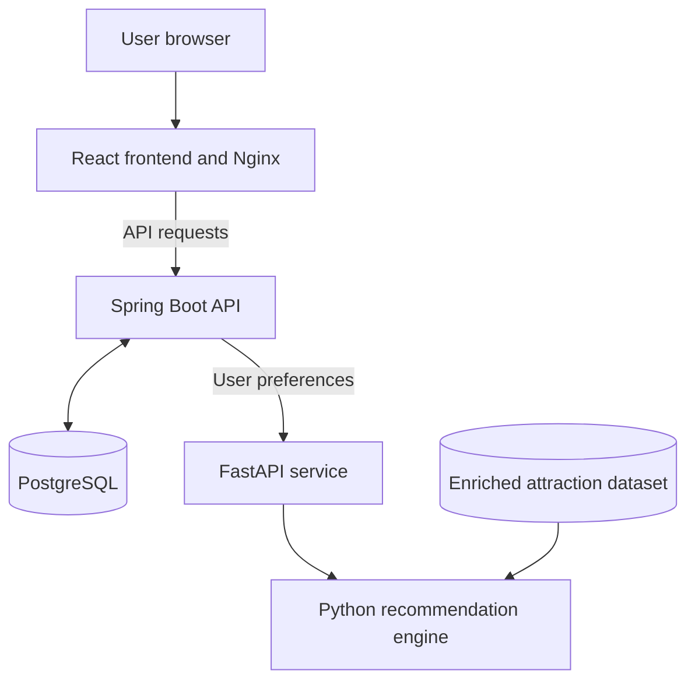
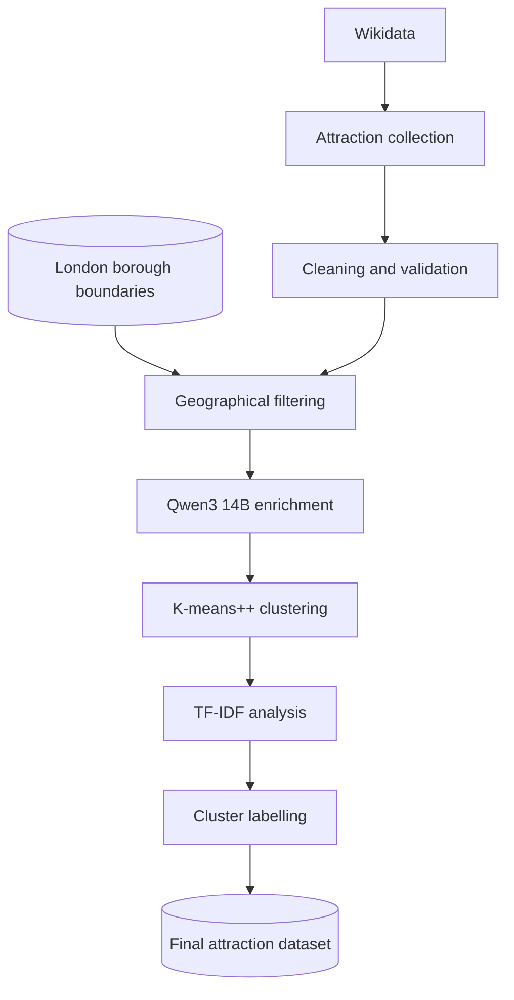
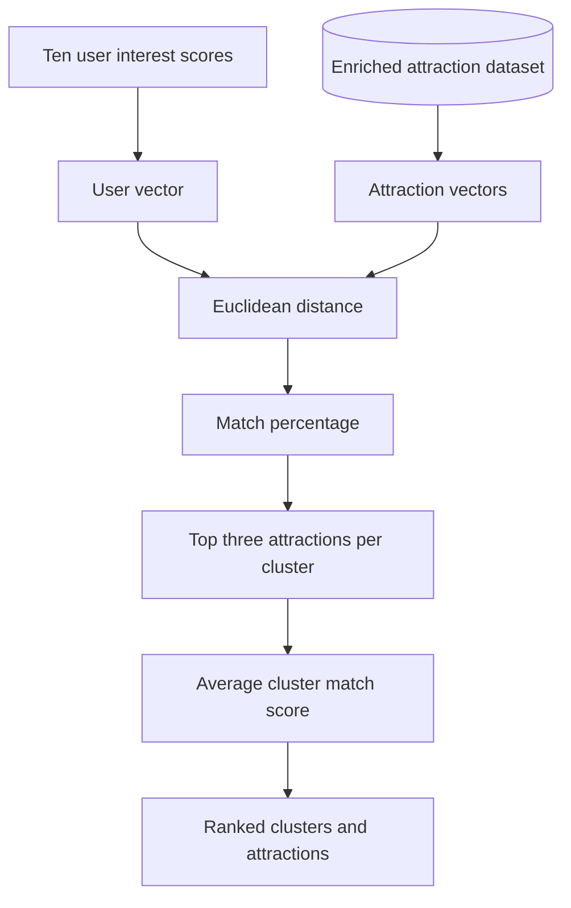
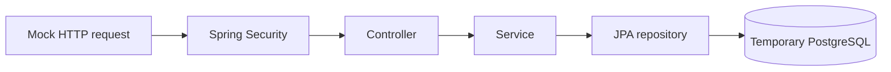

# Sightseer

[](https://github.com/efe-h/sightseer/actions/workflows/backend-test.yml)
[](https://github.com/efe-h/sightseer/actions/workflows/recommender-test.yml)

A full-stack London attraction recommender that matches users with top attractions and geographical areas based on 10 personal interest scores in these categories:

- History
- Art
- Architecture
- Nature
- Science
- Food
- Entertainment
- Shopping
- Views
- Family

<details>
<summary>Project Screenshots</summary>

### Login/Register Page





### Preferences Page



### Recommendations Page





### Attraction Modal



</details>

## Features

- Account registration and login using JWT authentication
- Ten-dimensional user interest profiles
- Personalised attraction match percentages
- Twenty-eight geographical attraction clusters across London
- Ranked clusters based on average attraction compatibility
- Top three attractions within each cluster
- Interactive map with selectable attraction markers
- Detailed attraction information including visit duration, price level and indoor/outdoor status
- Docker Compose setup for the complete application
- Automated Java and Python test workflows

## Architecture



The React frontend communicates with the Spring Boot API through Nginx. Spring Boot handles authentication, users and preferences.

When recommendations are requested, Spring loads the authenticated user's preferences from PostgreSQL and sends them to the FastAPI service. FastAPI executes the Python recommendation engine and returns ranked clusters and attractions.

## Data Pipeline



### Wikidata Collection

Attraction data was collected from Wikidata to obtain structured information such as:

- Attraction names and identifiers
- Geographical coordinates
- Categories and descriptions
- Image references where available

The raw data required cleaning, geographical filtering and LLM-assisted enrichment before it could support personalised recommendations.

### LLM Enrichment

The original Wikidata records did not contain enough consistent information to compare attractions across the supported interest categories. Therefore, an offline enrichment pipeline was created using Qwen3 14B through Ollama.

For every attraction, the model generated metadata as a fixed JSON structure:

- A concise summary
- Descriptive themes
- Scores from 1 to 5 for the ten supported interests
- Recommended visit time
- Estimated visit duration
- Indoor or outdoor classification
- Family-friendly classification
- Price level

Running the model locally avoided API costs during the enrichment stage.

The model is not called by the live application. Enrichment was performed once during preprocessing, and the resulting dataset is loaded directly by the FastAPI recommendation service.

### Geospatial clustering and NLP labelling

Attractions were grouped geographically using K-means++ based on their latitude and longitude.

Several cluster counts were evaluated using geographical visualisations and cluster-size statistics. The final dataset uses 28 clusters, balancing geographical coverage against clusters that were too large or too sparse.

DBSCAN was also evaluated, but it classified a proportion of the dataset as noise. Therefore, K-means++ produced more useful geographical coverage for the MVP.

After clustering, attraction summaries and themes were combined and processed using TF-IDF. The highest-weighted terms were inspected alongside each cluster's geographical location to create descriptive labels such as:

- Westminster — Royalty, Art and Heritage
- Kew and West London — Transport, Music and Heritage
- Camden and Marylebone — Literature, Art and Culture

## Recommendation Engine



Each user and attraction is represented by a ten-dimensional vector containing scores from 1 to 5 for:

- History
- Art
- Architecture
- Nature
- Science
- Food
- Entertainment
- Shopping
- Views
- Family

The engine calculates the Euclidean distance between the user and each attraction. The distance is normalised against the maximum possible distance and converted into a match percentage.

The three strongest attractions are selected from each geographical cluster, and clusters are ranked using their average match score.

## Technology stack

| Area               | Technologies                                                    |
| ------------------ | --------------------------------------------------------------- |
| Frontend           | React, TypeScript, Vite, Tailwind CSS, React Leaflet            |
| Backend            | Java, Spring Boot, Spring Security, JPA/Hibernate               |
| Recommendation API | Python, FastAPI, Pydantic, pandas, NumPy                        |
| Data processing    | GeoPandas, scikit-learn, TF-IDF, Ollama                         |
| Database           | PostgreSQL, Flyway                                              |
| Infrastructure     | Docker, Docker Compose, Nginx                                   |
| Testing and CI     | JUnit, Mockito, MockMvc, Testcontainers, pytest, GitHub Actions |

## Running Sightseer

### Prerequisites

You only need:

- Git
- Docker Desktop or Docker Engine with Docker Compose

Java, Python, Node.js and PostgreSQL do not need to be installed
separately.

### 1. Clone the repository

```bash
git clone https://github.com/efe-h/sightseer.git
cd sightseer
```

### 2. Create the environment file

On macOS or Linux:

```bash
cp .env.example .env
```

On Windows PowerShell:

```powershell
Copy-Item .env.example .env
```

Update `POSTGRES_PASSWORD` with a local database password of your choice. The default is `sightseer_password`.

Generate a JWT signing key:

```bash
openssl rand -base64 32
```

Place the generated value in `.env`:

```env
JWT_SECRET=your_generated_value
```

### 3. Start the application

```bash
docker compose up --build
```

Open Sightseer at:

http://localhost:3000

### 4. Stop the application

```bash
docker compose down
```

The PostgreSQL volume is preserved between runs.

## API documentation

With the application running, Spring's OpenAPI documentation is available at:

http://localhost:8080/swagger-ui/index.html

| Method | Endpoint               | Purpose                               |
| ------ | ---------------------- | ------------------------------------- |
| POST   | `/api/auth/register`   | Create an account                     |
| POST   | `/api/auth/login`      | Authenticate and receive a JWT        |
| GET    | `/api/mypreferences`   | Retrieve saved preferences            |
| PUT    | `/api/mypreferences`   | Create or update preferences          |
| GET    | `/api/recommendations` | Generate personalised recommendations |

## Testing

Sightseer uses unit and integration tests across both the Spring Boot
backend and Python recommendation service. The Java and Python test
suites run automatically through separate GitHub Actions workflows
on every push and pull request.

Running the application requires only Git and Docker. Running the
test suites directly additionally requires Java 17 and Python 3.12.
Docker must also be running for the Spring integration tests because
they use Testcontainers.

### Spring Boot tests

From the `backend` directory:

```bash
./gradlew test
```

On Windows:

```powershell
gradlew.bat test
```

The backend contains two types of tests:

- **Unit tests** isolate the service layer using JUnit, Mockito and
  mocked dependencies.
- **Integration tests** use MockMvc to send HTTP requests through the
  real Spring Security, controller, service and persistence layers.

The integration tests use Testcontainers to start a temporary
PostgreSQL database inside Docker. Flyway applies the same database
migration used by the application before the tests execute.



This verifies that authentication, request validation, JWT-protected
endpoints, JPA mappings, Flyway migrations and PostgreSQL operations
work together correctly.

The temporary database is isolated from the development database and
is automatically removed after the test run. Docker must therefore be
running when executing the backend integration tests.

### Recommendation service tests

From the repository root, install the Python dependencies:

```bash
python -m pip install -r rag-pipeline/requirements.txt
```

From the repository root:

```bash
python -m pytest recommendation_engine/tests
```

The Python test suite includes:

- Unit tests for preference validation, vector creation, match-score
  calculations, attraction selection and cluster ranking
- An integration test that runs the complete recommendation pipeline
  against the real attraction dataset
- FastAPI endpoint tests for the health and recommendation endpoints

### Continuous integration

GitHub Actions automatically runs the Java and Python test suites on
pushes and pull requests. This helps detect regressions before changes
are merged and ensures both application services remain independently
testable.

## Limitations

- LLM-generated interest scores are subjective and may contain inconsistencies.
- The current dataset is a static snapshot rather than a live Wikidata feed.
- K-means requires the number of clusters to be selected in advance.
- Attraction availability, prices and opening times are not updated in real time.
- Food and shopping attractions are underrepresented in the current dataset, which can produce lower match scores for users who strongly prioritise those interests.
